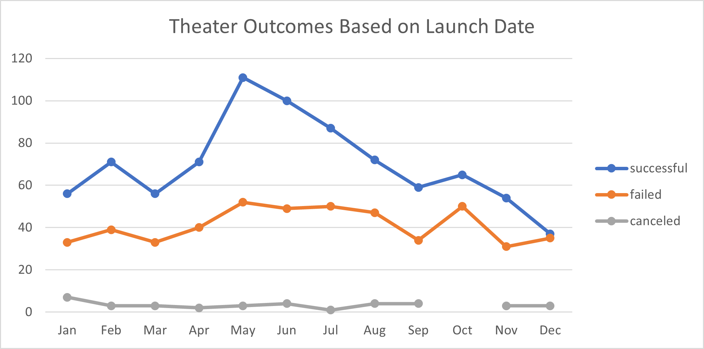
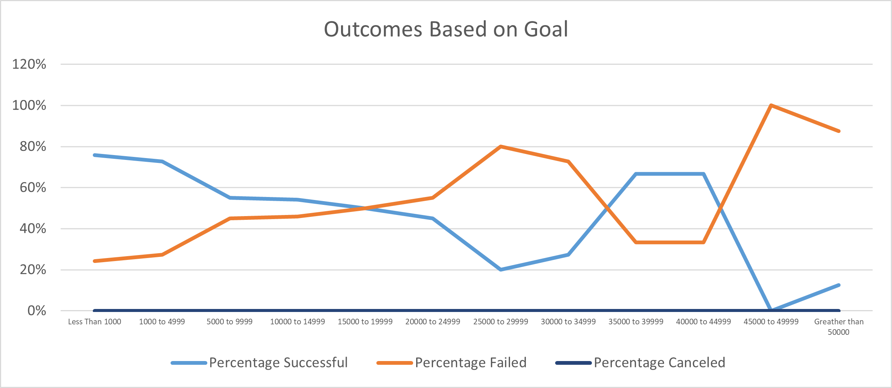

# Kickstarting with Excel 

## Overview of Project

After Louise's play *Fever* came close to its fundraising goal in a short amount of time, she wanted to know know more about of the other campaigns.

### Purpose

The purpose of this project is to understand if different campaigns fared in relation to their launch dates and their funding goals.

## Analysis and Challenges

The main analysis was conducted using Excel formulas, pivot tables, and charts. 

The two mains formulas used were:
- `COUNTIFS()`
- `SUM()`

### Analysis of Outcomes Based on Launch Date

### Analysis of Outcomes Based on Goals

### Challenges and Difficulties Encountered

When writing the Excel formulas, syntax is very important. One typo can cause data errors. 

## Results

- What are two conclusions you can draw about the Outcomes based on Launch Date?

:bulb:There are two conclusions that can be drawn based on the graphic above:
    - Summer has more successful campaings with May having the highest.
    - Failure has no relation with launch date. 

- What can you conclude about the Outcomes based on Goals?

:bulb:Using the chart above, as the goal size increases, the success rate decreases while the failure increases. However, there is an interesting twist in the goal range of 35000 to  44999. This may indicate a sweet spot to set goals. 

- What are some limitations of this dataset?

:bulb:There maybe outside influence that were not captured in this dataset that helps explains the success or failure of the campaigns.

- What are some other possible tables and/or graphs that we could create?
    - Outcome by country
    - Outcome by staff pick 
    - Outcome by backers_count
